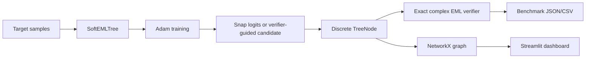

# EML Lab

EML Lab is a small research demo for discovering elementary formulas using one
operator:

```python
eml(x, y) = exp(x) - log(y)
```

The goal for v1 is intentionally narrow: recover shallow EML trees from numerical
data, snap the soft model into a discrete tree, and verify the snapped formula with
the exact complex-valued operator.

This repo is grounded in Andrzej Odrzywolek's paper
["All elementary functions from a single binary operator"](https://arxiv.org/abs/2603.21852).
It is not a replacement for the author's reproducibility code. It is a clean Python
lab for experimenting with the idea.

## What v1 Proves

- `exp(x)` recovers as `x 1 E`
- `ln(x)` recovers as `1 1 x E 1 E E`
- known shallow routes can be perturbed and snapped back to exact formulas
- every proof run verifies the snapped tree with raw complex EML, not the stabilized
  training helper

It does not claim reliable recovery of `sin(x)`, `x*y`, division, or general symbolic
regression. Those are Phase 2+.

## Quickstart

```bash
python3.11 -m venv .venv
source .venv/bin/activate
python -m pip install -e ".[dev]"
python -m pytest
python -m eml_lab train --target ln --depth 3 --seed 0
python -m eml_lab bench --suite shallow
python -m eml_lab campaign --suite phase2-foundation
python -m eml_lab campaign --suite phase2-research
python -m eml_lab research-report --root runs --output-dir runs/research-reports
python -m eml_lab campaign --suite phase2-operator-zoo
python -m eml_lab compare-methods --target ln
python -m eml_lab compare-methods-history --root runs
python -m eml_lab compare-methods-report --root runs
python -m eml_lab compare-methods-export --root runs --output-dir runs/exports
python -m eml_lab compare-methods-snapshot --root runs --output-dir runs/snapshots
python -m eml_lab compare-methods-snapshot-history --root runs/snapshots
python -m eml_lab compare-methods-snapshot-report --root runs/snapshots --output-dir runs/snapshot-reports
python -m eml_lab operator-zoo --output-dir runs
python -m eml_lab orchestrate --target ln --budget 24
python -m eml_lab app
```

The app runs Streamlit locally. It uses the same package APIs as the CLI.

Hosted-demo packaging lives in [docs/hosted-demo.md](docs/hosted-demo.md). The repo
includes Streamlit Cloud files, a Dockerfile, and local smoke commands.

## Screenshots


## CLI

Train one target:

```bash
python -m eml_lab train --target exp --depth 1 --seed 0
python -m eml_lab train --target ln --depth 3 --seed 0
```

Run the internal shallow benchmark suite:

```bash
python -m eml_lab bench --suite shallow --output-dir runs
```

Verified locally on CPU with Python 3.11 and PyTorch 2.11:

| Target | Depth | Snapped RPN | Max MSE | Snap source |
|---|---:|---|---:|---|
| `exp(x)` | 1 | `x 1 E` | `0.0` | logits |
| `ln(x)` | 3 | `1 1 x E 1 E E` | `1.86e-32` | best discrete |
| `x` | 4 | `1 1 x E 1 E E 1 E` | `3.16e-32` | logits |

The shallow suite recovered all three targets in the local smoke run.

Run an optional PySR comparison:

```bash
python -m eml_lab compare --target ln --output-dir runs
```

If `pysr` or `julia` is missing, EML Lab writes a comparison summary explaining what is
missing and how to install it, rather than failing mysteriously. This follows the PySR
project's documented install path: `pip install pysr`, with Julia dependencies installed
at first import.

Run the aggregated compare suite:

```bash
python -m eml_lab compare-suite --suite shallow --output-dir runs
```

This executes the optional baseline over all stable compare-eligible targets and writes
an aggregate summary plus per-target manifests. If PySR or Julia is missing, the suite
still writes the EML baselines and install guidance, then exits with code `3`.

Run the cross-method comparison on one target:

```bash
python -m eml_lab compare-methods --target ln --output-dir runs
```

This lines up the gradient baseline, the local agentic route search, and the optional
PySR baseline in one artifact bundle so you can compare snapped RPNs, verifier error,
and PySR availability from one summary file.

List saved cross-method runs:

```bash
python -m eml_lab compare-methods-history --root runs
```

The Streamlit Compare tab can now scan the same root directory, show saved
`method-compare-*` runs in a table, and reload any one of them back into the side-by-side
analysis view.

Summarize saved cross-method runs:

```bash
python -m eml_lab compare-methods-report --root runs
```

This aggregates saved artifacts into target-level rollups, including run counts, required
success rate, PySR availability rate, and the latest expression each method found.

The Compare tab now lets you filter those saved runs by target, status, and seed, then
inspect artifact-backed charts for runs by target, runs by seed, success rate by target,
and gradient vs. agentic error trends.

Export filtered analytics:

```bash
python -m eml_lab compare-methods-export --root runs --output-dir runs/exports --target exp --seed 1
```

This writes a timestamped export bundle with:
- `summary.json`
- `runs.csv`
- `latest_by_target.csv`
- `manifest.json`

The app can export the currently filtered saved-run view through the same package API.

Build a report-grade research snapshot:

```bash
python -m eml_lab compare-methods-snapshot --root runs --output-dir runs/snapshots --target exp --seed 1
```

This writes a timestamped snapshot bundle with:
- `summary.json`
- `runs.csv`
- `latest_by_target.csv`
- `report.md`
- `runs_by_target.png`
- `required_success_rate_by_target.png`
- `runs_by_seed.png`
- `status_counts.png`
- `error_trend.png`
- `manifest.json`

The Compare tab can build the same filtered snapshot bundle and preview the markdown
report directly in the dashboard.

Summarize saved snapshots over time:

```bash
python -m eml_lab compare-methods-snapshot-history --root runs/snapshots
python -m eml_lab compare-methods-snapshot-report --root runs/snapshots --output-dir runs/snapshot-reports
```

The history command lists timestamped snapshot bundles. The report command writes a
longer-horizon bundle with:
- `summary.json`
- `snapshots.csv`
- `target_trends.csv`
- `report.md`
- `required_success_rate_over_time.png`
- `run_count_over_time.png`
- `target_success_rate_over_time.png`
- `status_counts.png`
- `manifest.json`

The Compare tab can scan saved snapshots, show success/run-count trends, and build this
history report from the same package API.

Run the operator zoo:

```bash
python -m eml_lab operator-zoo --output-dir runs --grid-points 17
```

This benchmark compares EML-like operator variants on a deterministic complex stress
grid and writes:
- `summary.json`
- `candidates.csv`
- `report.md`
- `stability_scores.png`
- `manifest.json`

The faithful `exp(x) - log(y)` operator stays marked as the exact paper reference.
Stabilized variants are reported as research candidates for future training heuristics,
not as proof operators.

The same check is available as a campaign suite:

```bash
python -m eml_lab campaign --suite phase2-operator-zoo --output-dir runs
```

Run the dashboard through Docker:

```bash
docker build -t eml-lab .
docker run --rm -p 8501:8501 eml-lab
```

See [docs/hosted-demo.md](docs/hosted-demo.md) for Streamlit Community Cloud settings
and container notes.

Run the first Phase 2 campaign suite:

```bash
python -m eml_lab campaign --suite phase2-foundation --output-dir runs
```

This writes a campaign summary plus per-step manifests for the shallow benchmark and
optional comparison runs. Missing PySR stays non-fatal inside the campaign because the
comparison adapter is explicitly optional.

Run the research-tier hard-target campaign:

```bash
python -m eml_lab campaign --suite phase2-research --output-dir runs
```

This suite intentionally tracks `x^2`, `x*y`, division, and `sin(x)` as research
experiments. Failures stay visible in the artifacts with target tier, expected depth,
known failure modes, and verifier output; they are not reported as solved.

Build a per-target research report from saved research campaigns:

```bash
python -m eml_lab research-report --root runs --output-dir runs/research-reports
```

This writes a timestamped bundle with:
- `summary.json`
- `targets.csv`
- `runs.csv`
- `report.md`
- `manifest.json`

The report includes every research target, even when a target has not been run yet, so
the gap between "tracked" and "attempted" stays visible.

Run the local proposer/evaluator/pruner loop:

```bash
python -m eml_lab orchestrate --target ln --budget 24 --beam-width 6 --seed-count 4
```

This starts from deterministic perturbations of the target's known route, evaluates
full snapped trees with the exact verifier, and writes a leaderboard plus JSONL event
log. It is local-only and CPU-only.

Launch the dashboard:

```bash
python -m eml_lab app
```

## Architecture



## Numerical Policy

`eml_exact(x, y)` is the paper operator:

```python
torch.exp(x) - torch.log(y)
```

Inputs are converted to `torch.complex128`. This is the only operation used for final
verification.

`eml_train(x, y, StabilityConfig(...))` is a training helper. It clips real/imaginary
parts and nudges log inputs away from zero. It returns stability stats on request. It is
useful for avoiding NaNs during gradient descent, but it is not treated as mathematical
proof.

## Project Layout

```text
src/eml_lab/
  operators.py     exact and training-safe EML
  trees.py         immutable tree representation, RPN, NetworkX
  targets.py       known targets and paper fixtures
  soft_tree.py     differentiable soft-routed EML tree
  training.py      Adam loop, snapping, verification
  verify.py        exact raw-operator verifier
  artifacts.py     shared artifact manifest writer
  experiments.py   shared experiment result schemas
  benchmarks.py    shallow suite and artifact writing
  comparison.py    optional PySR baseline comparison
  campaigns.py     Phase 2 campaign suites
  research_reports.py per-target reports for research campaigns
  mutations.py     deterministic route mutations
  scoring.py       exact-verifier candidate scoring
  pruning.py       structural dedupe and beam pruning
  agentic.py       local proposer/evaluator/pruner loop
  operator_zoo.py  numerical research harness for EML-like variants
  cli.py           argparse CLI
  app.py           Streamlit dashboard
```

## Phase 2 Backlog

- reviewed execution plan: [docs/phase-2-plan.md](docs/phase-2-plan.md)
- shipped: local proposer/evaluator/pruner orchestrator on top of the experiment
  foundation
- shipped: compare-suite aggregation across stable targets with optional PySR install
  guidance
- shipped: research-tier campaign suite with explicit failure reporting for `x^2`,
  `x*y`, division, and `sin(x)`
- shipped: cross-method comparison runs for gradient, agentic, and optional PySR
  search
- shipped: saved cross-method artifact discovery and reload in the dashboard and CLI
- shipped: multi-run analytics for saved cross-method artifacts
- shipped: artifact-backed charts and target/seed filtering on top of saved analytics
- shipped: JSON/CSV export bundles for filtered saved-run analytics
- shipped: report-grade snapshot bundles with markdown summaries and plot images
- shipped: longer-horizon snapshot history reports over saved research snapshots
- shipped: operator zoo benchmark/report for EML-like numerical variants
- shipped: operator zoo campaign suite
- shipped: hosted-demo packaging for Streamlit Cloud and Docker
- shipped: per-target research report bundles for saved hard-target campaigns
- next milestone: final repository polish and release notes
