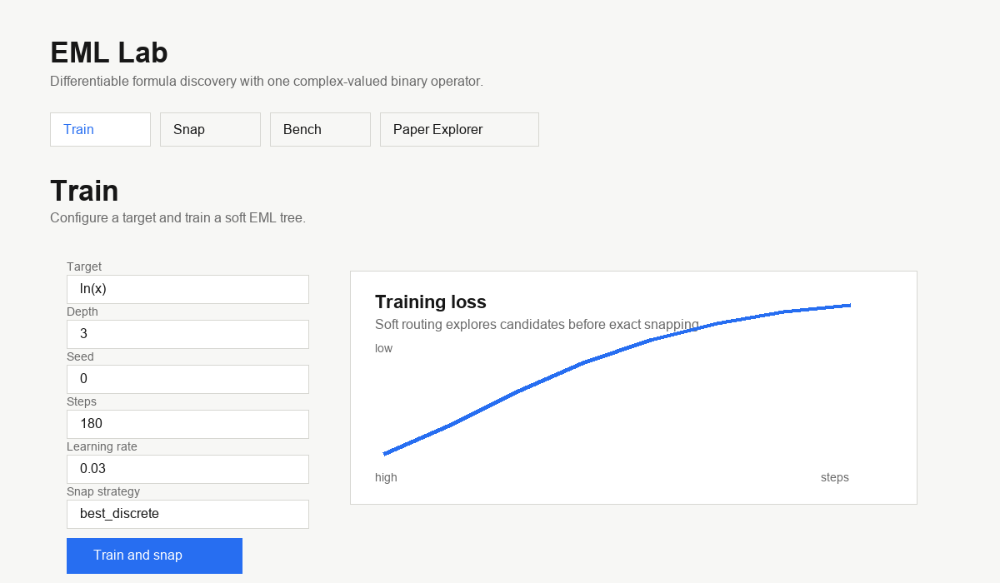
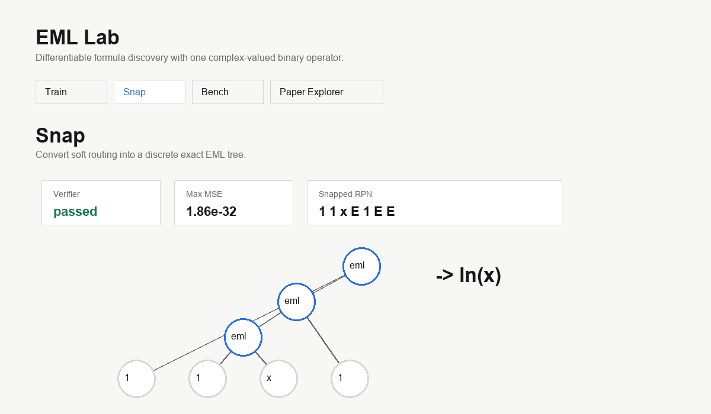
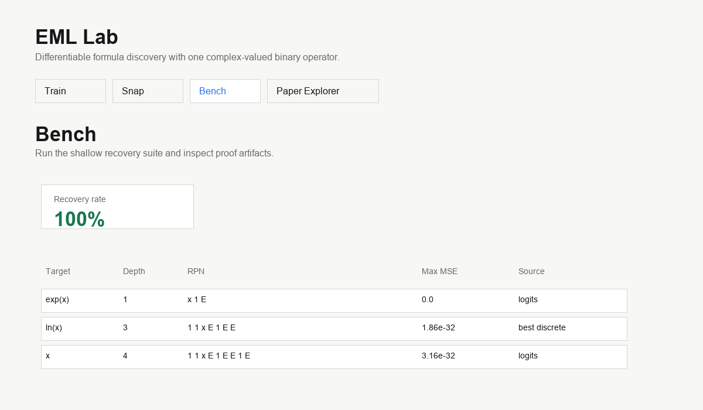
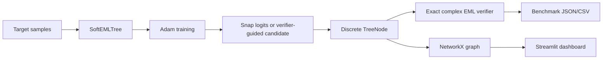

# EML Lab

EML Lab is a small research demo for discovering elementary formulas using one
operator:

```python
eml(x, y) = exp(x) - log(y)
```

The goal for v1 is intentionally narrow: recover shallow EML trees from numerical
data, snap the soft model into a discrete tree, and verify the snapped formula with
the exact complex-valued operator.

This repo is grounded in Andrzej Odrzywolek's paper
["All elementary functions from a single binary operator"](https://arxiv.org/abs/2603.21852).
It is not a replacement for the author's reproducibility code. It is a clean Python
lab for experimenting with the idea.

## What v1 Proves

- `exp(x)` recovers as `x 1 E`
- `ln(x)` recovers as `1 1 x E 1 E E`
- known shallow routes can be perturbed and snapped back to exact formulas
- every proof run verifies the snapped tree with raw complex EML, not the stabilized
  training helper

It does not claim reliable recovery of `sin(x)`, `x*y`, division, or general symbolic
regression. Those are Phase 2+.

## Quickstart

```bash
python3.11 -m venv .venv
source .venv/bin/activate
python -m pip install -e ".[dev]"
python -m pytest
python -m eml_lab train --target ln --depth 3 --seed 0
python -m eml_lab bench --suite shallow
python -m eml_lab app
```

The app runs Streamlit locally. It uses the same package APIs as the CLI.

## Screenshots







## CLI

Train one target:

```bash
python -m eml_lab train --target exp --depth 1 --seed 0
python -m eml_lab train --target ln --depth 3 --seed 0
```

Run the internal shallow benchmark suite:

```bash
python -m eml_lab bench --suite shallow --output-dir runs
```

Verified locally on CPU with Python 3.11 and PyTorch 2.11:

| Target | Depth | Snapped RPN | Max MSE | Snap source |
|---|---:|---|---:|---|
| `exp(x)` | 1 | `x 1 E` | `0.0` | logits |
| `ln(x)` | 3 | `1 1 x E 1 E E` | `1.86e-32` | best discrete |
| `x` | 4 | `1 1 x E 1 E E 1 E` | `3.16e-32` | logits |

The shallow suite recovered all three targets in the local smoke run.

Launch the dashboard:

```bash
python -m eml_lab app
```

## Architecture



## Numerical Policy

`eml_exact(x, y)` is the paper operator:

```python
torch.exp(x) - torch.log(y)
```

Inputs are converted to `torch.complex128`. This is the only operation used for final
verification.

`eml_train(x, y, StabilityConfig(...))` is a training helper. It clips real/imaginary
parts and nudges log inputs away from zero. It returns stability stats on request. It is
useful for avoiding NaNs during gradient descent, but it is not treated as mathematical
proof.

## Project Layout

```text
src/eml_lab/
  operators.py     exact and training-safe EML
  trees.py         immutable tree representation, RPN, NetworkX
  targets.py       known targets and paper fixtures
  soft_tree.py     differentiable soft-routed EML tree
  training.py      Adam loop, snapping, verification
  verify.py        exact raw-operator verifier
  benchmarks.py    shallow suite and artifact writing
  cli.py           argparse CLI
  app.py           Streamlit dashboard
```

## Phase 2 Backlog

- LangGraph/AutoGen proposer-evaluator-pruner plugin
- PySR comparison suite
- hosted demo
- operator zoo search for EML cousins
- hard targets: `x*y`, division, `x^2`, `sin(x)`
