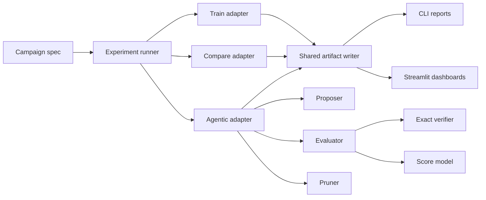
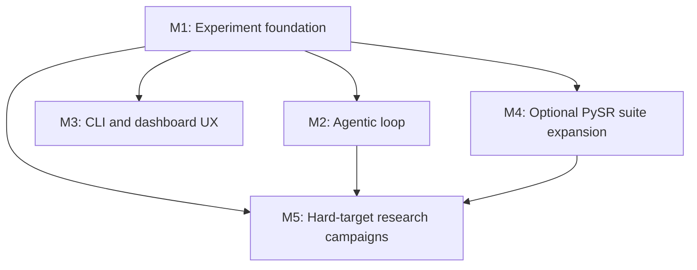
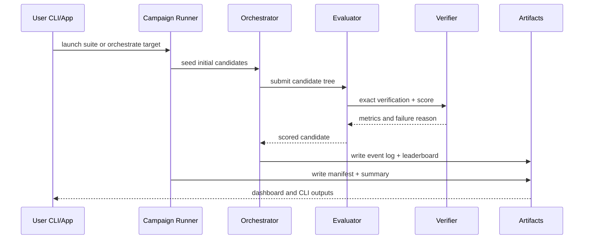

# Phase 2 Plan: Agentic Research Workbench

Generated on 2026-04-14
Status: IMPLEMENTED
Mode: Builder
Repo: `shrijacked/eml-lab`

## Problem Statement

EML Lab v1 proves shallow exact recovery for a few paper-grounded targets, but its
Phase 2 backlog is still a set of disconnected ideas. The next step is not "more
math" in isolation. The next step is a repeatable research workbench that lets us:

- run comparable search campaigns with shared artifacts
- layer a local proposer/evaluator/pruner loop on top of the exact EML engine
- expand optional PySR comparisons from one-off commands into real suite results
- stage harder targets as explicit research campaigns instead of ad hoc experiments

The core requirement is that every Phase 2 feature must orbit the exact verifier and
existing training engine. We are extending the lab, not replacing it.

## What Makes This Cool

- One lab can compare gradient search, exhaustive shallow snapping, agentic search,
  and optional PySR baselines with the same evaluator.
- The app becomes a live research console instead of a thin wrapper around one train
  command.
- "Hard targets" stop being vague aspirations and become named campaigns with
  budgets, outcomes, and artifacts.

## Constraints

- Local-first and CPU-first remain the default.
- `eml_exact` and the raw verifier stay authoritative for all final claims.
- Optional integrations like PySR and Julia must stay off the critical path.
- Streamlit must keep calling package APIs rather than duplicating logic.
- CI needs a deterministic smoke subset that does not require Julia, internet, or
  hosted services.

## Premises

1. Phase 2 should strengthen the experiment loop around the existing engine, not
   replace that engine with a separate symbolic system.
2. The first shippable Phase 2 slice must run with the current local Python stack.
3. Agentic orchestration is the most distinctive Phase 2 direction, but it depends
   on a shared experiment schema and artifact pipeline first.
4. Hard targets belong in a research tier with explicit status labels and retry
   budgets, not in the default "working" benchmark claims.

## Approaches Considered

### Approach A: Compare-Suite First

Summary: Turn the optional PySR command into a full target matrix with aggregated
metrics, then defer agents until after the benchmark harness is mature.

Effort: M
Risk: Low

Pros:
- smallest blast radius from the current codebase
- quickly improves credibility of README claims
- creates a better baseline for later agent experiments

Cons:
- depends on optional PySR/Julia for the marquee comparison story
- does not create a differentiated Phase 2 experience by itself
- leaves the most interesting backlog item, the orchestrator, as a stub

Reuses:
- `comparison.py`
- `benchmarks.py`
- `training.py`

### Approach B: Shared Experiment Runner + Local Multi-Agent Orchestrator

Summary: Build a common experiment protocol first, then implement a local
proposer/evaluator/pruner loop that uses the same EML engine, verifier, and
artifact schema as training and comparison runs.

Effort: L
Risk: Medium

Pros:
- best long-term architecture for the whole Phase 2 roadmap
- does not depend on Julia or hosted infra
- makes the Streamlit app and CLI much more compelling for AI/ML builders

Cons:
- requires up-front refactoring before the flashy part appears
- needs careful scoring and pruning rules to avoid "agent theater"
- touches CLI, app, benchmark, and result schemas together

Reuses:
- `training.py`
- `verify.py`
- `trees.py`
- `comparison.py`
- `benchmarks.py`

### Approach C: Operator Zoo First

Summary: Introduce alternative binary operators and run small search campaigns over
them before investing in orchestration.

Effort: L/XL
Risk: High

Pros:
- interesting research angle
- could uncover numerically friendlier cousins early

Cons:
- pulls attention away from the EML narrative too soon
- multiplies the benchmark surface before experiment tooling is ready
- makes success criteria fuzzier, not clearer

Reuses:
- `operators.py`
- `training.py`
- `verify.py`

## Recommendation

Choose **Approach B**.

It gives Phase 2 a strong spine:

1. shared experiment and artifact plumbing
2. local multi-agent orchestration on top of that plumbing
3. optional PySR suite expansion as one adapter
4. hard targets and operator-zoo experiments as campaign payloads

This is the cleanest dependency order and the best match for the repo's actual
strength: a verified EML engine with deterministic local tooling.

## Architecture

## Module Plan

### M1: Experiment Foundation

Goal: unify how training, benchmarks, comparisons, and later agentic runs describe
inputs, outputs, artifacts, and success.

Planned modules:
- `src/eml_lab/experiments.py`
- `src/eml_lab/artifacts.py`
- `src/eml_lab/campaigns.py`

Planned changes:
- add typed experiment specs and results
- add a stable artifact manifest with paths for metrics, logs, plots, and trees
- refactor `benchmarks.py` and `comparison.py` to use the shared result schema
- add target metadata for tiers such as `stable` and `research`

Acceptance tests:
- experiment specs round-trip through JSON without losing fields
- campaign output directories always contain a manifest and summary
- existing `train`, `bench`, and `compare` commands preserve current behavior

### M2: Local Multi-Agent Orchestrator

Goal: run a deterministic proposer/evaluator/pruner loop without introducing LLM or
network dependencies into the critical path.

Planned modules:
- `src/eml_lab/agentic.py`
- `src/eml_lab/mutations.py`
- `src/eml_lab/scoring.py`
- `src/eml_lab/pruning.py`

Planned changes:
- proposer generates route mutations, depth expansions, and seeded known-route edits
- evaluator scores candidates using exact verification, train loss, complexity, and
  numerical stability penalties
- pruner deduplicates structurally equivalent candidates and drops fragile trees
- write JSONL event logs and a candidate leaderboard per run

Acceptance tests:
- proposer output is deterministic for a fixed seed
- pruner removes duplicates while preserving the best score
- orchestrator improves or matches the initial candidate on a shallow target within a
  fixed budget

### M3: CLI and Dashboard UX

Goal: expose the new research loop without making the CLI or app feel like a toy.

Planned changes:
- add CLI commands:
  - `python -m eml_lab campaign --suite phase2`
  - `python -m eml_lab orchestrate --target ln --budget 64`
  - `python -m eml_lab compare-suite --suite shallow`
- add Streamlit tabs for campaign traces, agent event logs, and leaderboard views
- keep all UI reads backed by the same artifact manifest used by the CLI

Acceptance tests:
- CLI dry runs and smoke runs create expected artifacts
- Streamlit imports cleanly and renders the new tabs
- app state survives missing optional dependencies with clear status messages

### M4: Optional PySR Suite Expansion

Goal: graduate PySR from a single-target optional command into a real comparison
adapter without making Julia mandatory.

Planned changes:
- add compare-suite execution over all eligible real-valued univariate targets
- record aggregated success, runtime, and best-equation summaries
- hard-skip unavailable environments with machine-readable install guidance

Acceptance tests:
- suite summary writes even when PySR is unavailable
- fake PySR test doubles cover aggregated report paths
- real PySR remains optional in docs, CLI, and app

### M5: Hard-Target Research Campaigns

Goal: turn the backlog items into explicit research objects with success criteria.

Planned changes:
- add research-tier target specs for `mul`, `div`, `square`, and `sin`
- record per-target notes on domain restrictions, expected depth, and failure modes
- keep these out of the default "stable" benchmark claims

Acceptance tests:
- research targets appear in campaign listings with status labels
- default stable suites exclude research-only targets
- failed research runs report why they failed

## Data Flow

## Traceable Task List

| Task ID | Milestone | Description | Depends On | Diagram |
| --- | --- | --- | --- | --- |
| T1 | M1 | Add experiment, campaign, and artifact dataclasses | none | Architecture |
| T2 | M1 | Refactor benchmark and comparison outputs onto the shared schema | T1 | Architecture |
| T3 | M1 | Introduce target tier metadata and campaign registry | T1 | Dependency graph |
| T4 | M2 | Implement proposer mutations and deterministic seeding | T1-T3 | Data flow |
| T5 | M2 | Implement evaluator scoring and pruning rules | T4 | Data flow |
| T6 | M2 | Persist agent event logs and leaderboard summaries | T4-T5 | Data flow |
| T7 | M3 | Add campaign/orchestrate/compare-suite CLI commands | T1-T6 | Architecture |
| T8 | M3 | Add Streamlit tabs for traces and leaderboards | T6-T7 | Architecture |
| T9 | M4 | Expand PySR into aggregated optional suites | T1-T3 | Architecture |
| T10 | M5 | Add research-tier hard targets and reporting | T1-T6 | Dependency graph |
| T11 | Polish | Add per-target research report bundles and dashboard preview | T10 | Data flow |

## Review Findings

### CEO Review

- Do not start Phase 2 with operator zoo work. It diffuses the product story before
  the lab workflow is strong.
- The wedge for AI/ML builders is "research campaign orchestration with verified
  artifacts," not "we also have a few more formulas."

### Design Review

- The dashboard should foreground leaderboard, best candidate, and failure reasons
  before raw logs.
- Agent activity must feel causal. Show proposal -> score -> prune -> best-so-far,
  not an undifferentiated event dump.

### Engineering Review

- Shared result schemas come before any agent loop. Otherwise every Phase 2 feature
  invents its own artifact format.
- Keep the orchestrator local and deterministic first. LLM-backed agents can be a
  later adapter, not the foundation.

### DX Review

- Every Phase 2 command needs a single obvious invocation and predictable run
  directory structure.
- Missing optional dependencies must produce install guidance, never stack traces.

## GSTACK Review Report

| Review | Trigger | Why | Runs | Status | Findings |
| --- | --- | --- | --- | --- | --- |
| CEO Review | `/plan-ceo-review` via `/autoplan` | choose the right wedge | 1 | clean | recommend workbench first, not operator zoo |
| Design Review | `/plan-design-review` via `/autoplan` | shape the dashboard and logs | 1 | clean | show causality and best-so-far first |
| Eng Review | `/plan-eng-review` via `/autoplan` | enforce dependency order | 1 | clean | shared schema before agents |
| DX Review | `/plan-devex-review` via `/autoplan` | keep research workflows usable | 1 | clean | single commands, deterministic artifacts |

## Success Criteria

Phase 2 initial slice is ready to implement when the following are true:

- one artifact schema is shared by train, bench, compare, and orchestrate flows
- a local orchestrator can improve or match a seeded shallow baseline on at least one
  target with deterministic tests
- the app can visualize agentic runs without reimplementing math or parsing
  ad hoc files
- optional PySR suites degrade gracefully when Julia is absent
- hard targets are explicitly labeled as research, not shipped claims
- saved hard-target campaigns can be summarized into per-target markdown, JSON, and
  CSV report bundles

## Recommended Build Order

1. M1: Experiment foundation
2. M2: Local multi-agent orchestrator
3. M3: CLI and dashboard UX
4. M4: Optional PySR suite expansion
5. M5: Hard-target research campaigns

## Out of Scope for the First Phase 2 Slice

- hosted infrastructure
- LLM-backed agents
- CUDA-specific optimization
- operator-zoo expansion
- claiming reliable recovery for `sin(x)` or other hard targets
